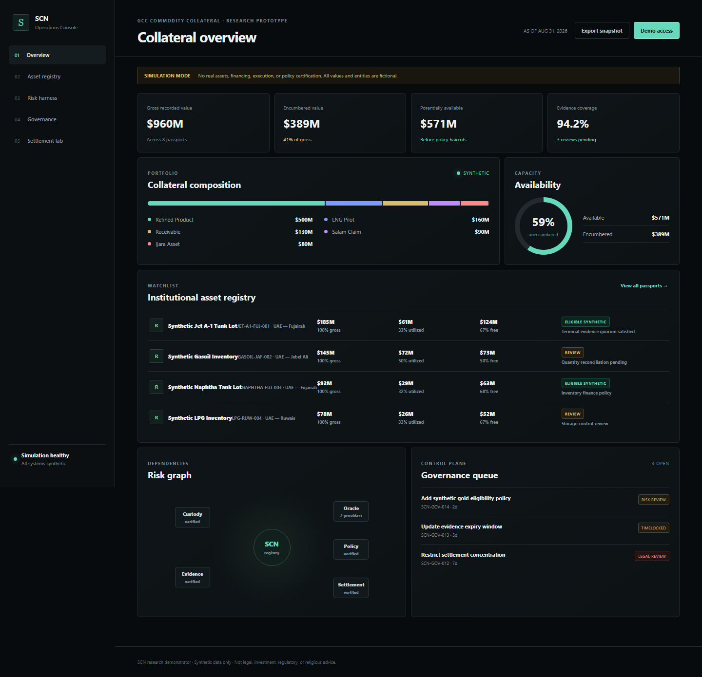

# Sovereign Collateral Network

> Programmable institutional collateral with evidence, policy, and governance.

**Status:** research prototype / institutional design demonstrator  
**Public boundary:** this repository intentionally excludes proprietary collateral algorithms, investor pipeline data, legal structuring work, Sharia rulings, production keys, live-money execution, and the private product roadmap.

## What this is

Sovereign Collateral Network (SCN) is a prototype operating system for turning complex digital and real-world assets into **verifiable, policy-aware collateral**.

The public demonstrator shows the shape of the system:

1. **Asset Passport** — ownership, custody, provenance, jurisdiction and review metadata.
2. **Encumbrance Ledger** — what has already been pledged, borrowed against, or otherwise restricted.
3. **Collateral Registry** — synthetic eligibility status and conservative public demonstration haircuts.
4. **Governance Console** — proposal lifecycle, approval boundaries, timelocks and emergency controls.
5. **Risk Graph** — dependency and exposure visualization.
6. **Settlement Simulator** — synthetic mint/redeem accounting only.
7. **Policy Rail** — demonstrates that different regulatory / institutional / Sharia-governance policies can be evaluated against the same neutral asset record.

## What this is NOT

This repository is **not**:
- a stablecoin issuer;
- a bank;
- an exchange;
- a broker-dealer;
- an investment fund;
- a money transmitter;
- an investment adviser;
- a custody service;
- a Sharia certification service;
- a source of legal, tax, regulatory, investment, or religious advice;
- authorization to deploy leveraged financial products.

No real client assets, live borrowing, live derivatives, or autonomous financial execution belong in the public prototype.

## Core thesis

Financial systems become safer and more useful when they can answer, before financing an asset:

- What is it?
- Who owns it?
- Who controls it?
- Where is it custodied?
- What evidence supports those claims?
- Who else already has a claim on it?
- What policies govern its use?
- What happens if its value, liquidity, counterparty, oracle, or settlement asset fails?

SCN is designed around those questions.

## Public architecture

```text
Asset / Claim
     |
     v
Asset Passport
     |
     +---- Evidence & provenance
     +---- Custody state
     +---- Jurisdiction metadata
     +---- Policy attestations
     |
     v
Encumbrance Ledger
     |
     v
Collateral Registry
     |
     +---- Eligibility state
     +---- Concentration state
     +---- Liquidity state
     |
     v
Risk Graph ------> Governance Console
     |
     v
Synthetic Financing / Settlement Simulator
```

## Repository layout

```text
.
├── README.md
├── docs/
│   ├── PRODUCT_OVERVIEW.md
│   ├── GOVERNANCE_OVERVIEW.md
│   ├── ASSET_PASSPORT_SPEC.md
│   ├── THREAT_MODEL.md
│   ├── REGULATORY_BOUNDARY.md
│   ├── HYDROCARBON_COLLATERAL_OVERVIEW.md
│   └── PUBLIC_PRIVATE_BOUNDARY.md
├── schemas/
│   ├── asset_passport.schema.json
│   ├── governance_proposal.schema.json
│   └── encumbrance.schema.json
├── demo/
│   ├── index.html
│   ├── styles.css
│   ├── app.js
│   └── synthetic_assets.json
└── LICENSE-NOTICE.md
```

## Demo

The demo is intentionally dependency-free.

```bash
cd demo
python3 -m http.server 8080
```

Open `http://localhost:8080`.

The demo uses synthetic assets only.

### Demonstrated workflows

- portfolio composition and encumbrance capacity;
- searchable, inspectable asset passports and evidence records;
- multi-scenario stress testing with explicit control responses;
- governance proposal routing and separation of powers;
- synthetic financing policy checks with a visible decision trace;
- stable-asset launch gates that remain intentionally uncleared;
- JSON snapshot export for offline review.

The console is dependency-free at runtime. A Playwright browser check is included in `tests/verify-demo.cjs` for environments where Playwright is available.



## Design principles

- Evidence before inference.
- Gross exposure is not net economic capital.
- Encumbrance must be visible.
- Governance power must be measurable.
- Emergency authority must be bounded.
- Policy opinions are scoped and versioned, never implied.
- Real-money capabilities require separate regulated workstreams.
- A settlement token is the **last** layer, not the first.

## Commercial positioning

> We turn complex real-world and digital assets into institutionally verifiable, policy-aware collateral that can safely move through programmable financial markets.

The public repository demonstrates the architecture without publishing the proprietary underwriting, routing, governance, and market-entry logic.
